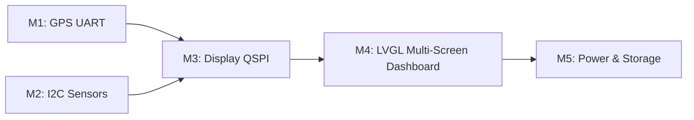

# ESP32-C6 Outdoor GPS Tracker — Kế Hoạch Phát Triển

> **Board:** Waveshare ESP32-C6-Touch-AMOLED-1.64
> **Framework:** PlatformIO + Arduino
> **Ngày bắt đầu:** 2026-09-26

---

## Thông Số Phần Cứng Xác Nhận (Thực tế)

| Thành phần | Thông số |
|---|---|
| CPU | ESP32-C6 RISC-V single-core @ 160 MHz |
| SRAM | **512 KB on-chip — KHÔNG CÓ PSRAM ngoài** |
| Flash | 16 MB |
| Màn hình | AMOLED 1.64", **280 × 456 px**, giao tiếp QSPI |
| Touch | FT3168 (I2C, địa chỉ `0x38` vật lý / `0x7E` register) |
| IMU | QMI8658 (I2C, địa chỉ `0x6B`, tích hợp sẵn) |
| GPS | ATGM336H (ngoài, UART1) |
| Áp suất | BMP580 (ngoài, I2C) |
| Storage | Khe Micro SD tích hợp |
| Nguồn | Mạch sạc pin Li-Po 3.7V tích hợp |

---

## Sơ Đồ Chân (Pin Map) Đã Xác Nhận

### QSPI Display (Driver SH8601)

| Tín hiệu | GPIO |
|---|---|
| CS | 10 |
| CLK | 11 |
| D0 | 4 |
| D1 | 5 |
| D2 | 7 |
| D3 | 19 |
| RST | **20** |

### I2C Bus (SDA=18, SCL=8)

### GPS UART1 — ATGM336H

| Tín hiệu | GPIO | Ghi chú |
|---|---|---|
| RX (← nhận từ GPS TX) | **GPIO 2** | Dây từ ATGM336H TX |
| TX (→ gửi tới GPS RX) | **GPIO 3** | Thường không cần dùng |

> ⚠️ **CẢNH BÁO QUAN TRỌNG — GPIO16 / GPIO17 BỊ CẤM:**
> Hai chân này được ESP32-C6 dùng nội bộ cho LP_UART (Low-Power UART).
> Khi gán UART1 vào GPIO16/17, hàm `uart_driver_install()` xung đột ngay lúc boot
> → **WDT crash loop, board reboot liên tục**. Đây là lỗi đã được tái hiện và xác nhận.

---

## Địa Chỉ I2C Thực Tế (Bus Scan xác nhận)

| Địa chỉ | Thiết bị | Ghi chú |
|---|---|---|
| `0x38` | FT3168 Touch controller | Địa chỉ vật lý thực; driver còn map `0x7E` |
| `0x47` | BMP580 Barometer | SDO nối VCC → địa chỉ `0x47` (không phải `0x46`) |
| `0x6B` | QMI8658 IMU built-in | 6-axis: accelerometer + gyroscope |
| `0x7E` | FT3168 / PMIC phụ | Có thể là PMIC hoặc touch register phụ |

---

## Ghi Chú LVGL — Giới Hạn SRAM ESP32-C6

> **KHÔNG CÓ PSRAM** — toàn bộ LVGL buffer phải nằm trong 512 KB SRAM on-chip.

- **Draw buffer tối đa:** ~1/10 màn hình = **280 × 45 px** (~49 KB/buffer, dùng double-buffer)
- **Nền `#000000` (đen tuyệt đối):** tối ưu cho AMOLED — pixel đen = pixel tắt = tiết kiệm điện
- **Khai báo font:** Phải bật ở CẢ HAI nơi:
  - `lv_conf.h`: `#define LV_FONT_MONTSERRAT_xx 1`
  - `platformio.ini`: `-DLV_FONT_MONTSERRAT_xx=1`
  - Thiếu một trong hai → linker error `undefined reference to 'lv_font_montserrat_xx'`
- **Thread safety:** Mọi thao tác LVGL từ ngoài LVGL task phải bọc trong `example_lvgl_lock(-1)` / `example_lvgl_unlock()`
- **`lv_label_set_text_fmt` + `%f`** bị vô hiệu hóa trong build Arduino LVGL để tiết kiệm RAM → dùng `snprintf()` + `lv_label_set_text()` thay thế

---

## Thư Viện Sử Dụng

| Thư viện | Phiên bản | Mục đích |
|---|---|---|
| `TinyGPSPlus` | latest | Parse NMEA từ ATGM336H |
| `Adafruit BMP5xx Library` | `^1.0.2` | Driver BMP580 — thay thế Adafruit_BMP3XX |
| `Adafruit BusIO` | `^1.16.1` | I2C/SPI HAL |
| `Adafruit Unified Sensor` | `^1.1.14` | Sensor abstraction |
| `lewisxhe/SensorLib` | `^0.5.0` | Driver QMI8658 (`SensorQMI8658.hpp`) |
| `lvgl/lvgl` | `^8.4.0` | Graphics UI framework |
| Waveshare AMOLED BSP | local `lib/` | QSPI display + LVGL glue (`lcd_bsp.h`) |

> **Lưu ý:** `Adafruit_BMP3XX` KHÔNG tương thích BMP580 — lib đó chỉ nhận chip ID `0x50`/`0x60` (BMP388/390).
> Hàm `bmp.pressure` của BMP5xx trả về **hPa trực tiếp** — không cần chia 100.

---

## platformio.ini Key Settings

```ini
[env:esp32c6_tracker]
platform = espressif32
board = esp32-c6-devkitc-1
framework = arduino
monitor_dtr = 0    ; QUAN TRỌNG: ngăn Serial Monitor reset board khi mở
monitor_rts = 0
board_build.flash_size = 16MB

build_flags =
    -DGPS_RX_PIN=2
    -DGPS_TX_PIN=3
    -DGPS_BAUD=9600
    -DI2C_SDA_PIN=18
    -DI2C_SCL_PIN=8
    -DBMP580_I2C_ADDR=0x47
    -DLV_CONF_INCLUDE_SIMPLE
    -DLV_COLOR_DEPTH=16
    -DLV_FONT_MONTSERRAT_20=1
    -DLV_FONT_MONTSERRAT_28=1
    -DLV_FONT_MONTSERRAT_32=1

lib_deps =
    mikalhart/TinyGPSPlus
    adafruit/Adafruit Unified Sensor @ ^1.1.14
    adafruit/Adafruit BusIO          @ ^1.16.1
    adafruit/Adafruit BMP5xx Library @ ^1.0.2
    lewisxhe/SensorLib               @ ^0.5.0
    lvgl/lvgl                        @ ^8.4.0
```

---

## Dependency Graph



---

## [x] Milestone 1 — GPS ATGM336H qua UART1 ✅ HOÀN THÀNH

**Kết quả thực tế:**
- UART1 chạy ổn định trên GPIO2(RX)/GPIO3(TX) ở 9600 baud
- TinyGPSPlus parse thành công hàng chục nghìn NMEA chars (chars > 30,000, fixes = 0 do test trong nhà)
- Không crash, không lỗi checksum
- **Fix quan trọng:** Chuyển từ GPIO16/17 → GPIO2/GPIO3 để khắc phục WDT crash do LP_UART conflict

**Output thực tế:**
```
  [GPS] ATGM336H
    Vi tri     : Chua fix (dang tim ve tinh...)
    Ve tinh    : 0
    NMEA       : chars=30452  fixes=0  err=0
```

---

## [x] Milestone 2 — I2C Sensors (BMP580 + QMI8658) ✅ HOÀN THÀNH

**Kết quả thực tế:**
- I2C Bus scan phát hiện đủ 4 thiết bị: `0x38`, `0x47`, `0x6B`, `0x7E`
- BMP580 tại `0x47` (SDO=VCC): khởi tạo thành công, đọc ổn định
- QMI8658 tại `0x6B`: phát hiện, khởi tạo thành công với SensorLib
- **Fix quan trọng:** Thay `Adafruit_BMP3XX` bằng `Adafruit BMP5xx Library`

**Output thực tế:**
```
  [BMP] BMP580
    Nhiet do   : 31.49 °C
    Ap suat    : 1009.61 hPa
    Cao do Baro: 30.4 m
```

---

## [x] Milestone 3 — AMOLED Display Bring-up (QSPI SH8601) ✅ HOÀN THÀNH

**Kết quả thực tế:**
- Tích hợp Waveshare BSP: `lcd_bsp.c`, `esp_lcd_sh8601`, `lcd_config.h`
- Chỉnh RST pin = **GPIO20** (theo schematic board thực tế)
- LVGL khởi tạo thành công — màn hình sáng, hiển thị text màu xanh lá
- LVGL chạy trong FreeRTOS task riêng (`example_lvgl_port_task`)
- Expose `example_lvgl_lock` / `example_lvgl_unlock` ra `lcd_bsp.h` với `extern "C"`
- Dashboard cơ bản hiển thị: Sats, Speed, Lat/Lng, Temp/Pressure, Tilt

---

## [ ] Milestone 4 — LVGL Dashboard Multi-Screen (3 Trang) 🔧 ĐANG TRIỂN KHAI

**Mục tiêu:** Giao diện đa trang dùng `lv_tileview` — người dùng vuốt trái/phải để chuyển trang.

### Kiến trúc: `lv_tileview` với swipe gesture (FT3168 Touch)

```
[ Trang 1: Outdoor ] ←→ [ Trang 2: Navigation ] ←→ [ Trang 3: System ]
```

---

### Trang 1 — Outdoor Sensors

```
┌──────────────────────────┐  280 px
│  Sats: 9  |  Bat: 87%   │  Header   (cyan, size 20)
├──────────────────────────┤
│         5.2 km/h         │  Speed    (white, size 32)
├──────────────────────────┤
│     Lat: 21.027764       │
│     Lng: 105.834160      │  Coords   (yellow, size 20)
│     Alt: 30.4 m          │
├──────────────────────────┤
│  T: 31.5°C | P: 1009 hPa│  Env      (green, size 20)
└──────────────────────────┘  456 px
```

| Widget | Nội dung | Font / Màu |
|---|---|---|
| Header | `Sats: N \| Bat: XX%` | Size 20, Cyan |
| Speed | `X.X km/h` | Size 32, White |
| Coords | Lat / Lng / Alt GPS | Size 20, Yellow |
| Env | Nhiệt độ + Áp suất hPa | Size 20, Green |

---

### Trang 2 — Navigation & Compass

```
┌──────────────────────────┐
│      NE (045 deg)        │  Direction  (orange, size 32)
├──────────────────────────┤
│   Tilt: P: 5°  R: -2°   │  IMU Tilt   (gray, size 20)
├──────────────────────────┤
│  [GPS Course khi >0.5km/h│  Note       (dimgray, size 14)
│   IMU cho Pitch/Roll]    │
└──────────────────────────┘
```

| Widget | Nội dung | Font / Màu |
|---|---|---|
| Direction | `NE (045 deg)` — GPS Course | Size 32, Orange |
| IMU Tilt | `Pitch: X°  Roll: X°` | Size 20, Gray |

> **Lưu ý:** Board không có magnetometer (la bàn từ tính).
> La bàn dùng **GPS Course Over Ground** — chỉ chính xác khi tốc độ > 0.5 km/h.
> IMU QMI8658 cung cấp Pitch/Roll (độ nghiêng), không phải Yaw.

---

### Trang 3 — Connectivity & System

```
┌──────────────────────────┐
│  GPS: chars=12k fixes=0  │  GPS Stats  (white, size 20)
├──────────────────────────┤
│  Uptime: 00:15:32        │  Uptime     (white, size 20)
├──────────────────────────┤
│  Bat: 87%  (*dự phòng)   │  Battery    (yellow, size 20)
│  SD: No card (*dự phòng) │  SD Card    (cyan, size 20)
└──────────────────────────┘
```

> (*) Battery % và SD Card cần xác nhận thêm về hardware (ADC pin, SPI SD).

---

### Tasks Milestone 4

- [ ] Triển khai `lv_tileview` với 3 tiles nằm ngang
- [ ] Kết nối swipe gesture từ FT3168 touch (I2C `0x38`)
- [ ] Build Trang 1: Outdoor Sensors (layout hoàn chỉnh)
- [ ] Build Trang 2: Navigation với compass text + IMU tilt
- [ ] Build Trang 3: GPS stats + Uptime counter
- [ ] `lv_timer` refresh mỗi trang theo tần suất phù hợp
- [ ] Kiểm tra RAM usage — không vượt quá 360 KB heap

---

## [ ] Milestone 5 — Power & Storage

- [ ] Đọc ADC pin Li-Po, hiển thị % còn lại
- [ ] Tích hợp Micro SD — log GPS track ra file `.gpx` hoặc `.csv`
- [ ] Deep sleep khi không hoạt động
- [ ] OTA update qua WiFi (tùy chọn)

---

## Ý Tưởng Phát Triển Tương Lai

| Tính năng | Mô tả |
|---|---|
| 🗺️ Bản đồ offline | Đọc tiles OpenStreetMap từ Micro SD |
| 📍 Waypoints | Lưu và điều hướng đến điểm đã đánh dấu |
| 📊 Track recording | Ghi route GPS, export file GPX ra SD |
| 📶 BLE streaming | Stream dữ liệu GPS đến điện thoại |
| 🌐 OTA update | Cập nhật firmware qua WiFi ngoài trời |
